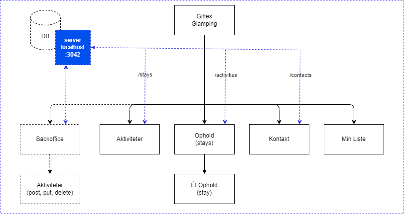

```

Project : Gittes Glamping
Description : Kravsbeskrivelse.
```

# Gittes Glamping

En lille booking applikation.

## Indledning

Dette er en hel rå kravs-beskrivelse.

## Obligatoriske Opgaver.

1. Mobile first frontend i forhold til figma.
    1. Forside
    2. Ophold (stays)
    3. Opholds enkelt visnings Side (stay)
    4. Kontakt 
        * Valideret kontaktformular der sender info til serveren.
        * Skriv navnet på afsenderen i "Besked Sendt (figma)"
    5. Aktiviteter
        1. Klik på hjerte og gem/toggle til "min liste" (localstorage)
    6. Min Liste
        1. Vis listen af de aktiviteter du har tilføjet til "min liste"
    7. Backoffice (Ikke mobil krav).
        1. Aktiviteter
            1. Post, Put, Delete 

## Minimum 1. Tilvalg

1. Responsive breakpoint > 1024px.
2. Authentication
    1. Slå auth til på server
    1. Sign In 
3. Backoffice
    1. Stays
        1. Post, Put, Delete


## Navigations Diagram



Du skal ikke følge denne slavisk men den er tilføjet for at illustrere hensigten.

**Obligatorisk sider** 
1. "/"
2. "/aktiviteter"
2. "/aktiviteter/aktivitet"
2. "/kontakt"
2. "/minliste"
2. "/backoffice"
2. "/backoffice/aktiviteter"

**Tilvalgs Sider**
2. "/backoffice/ophold"           

## Design Noter.

**Font**
1. Overskrifter, Knapper
Zen Loop (https://fontsource.org/fonts/zen-loop)

2. Body
NanumGothic (https://fontsource.org/fonts/nanum-gothic)